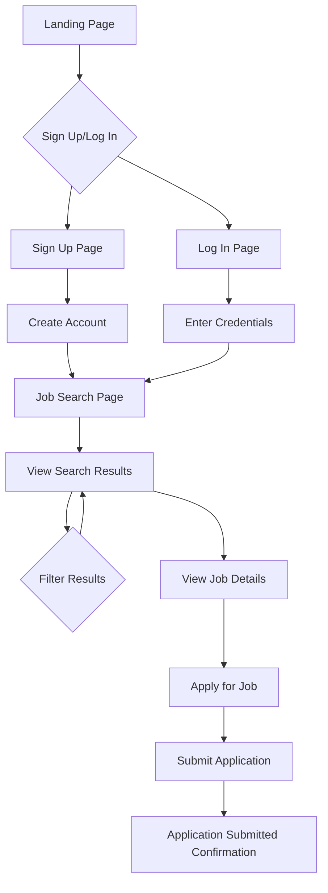
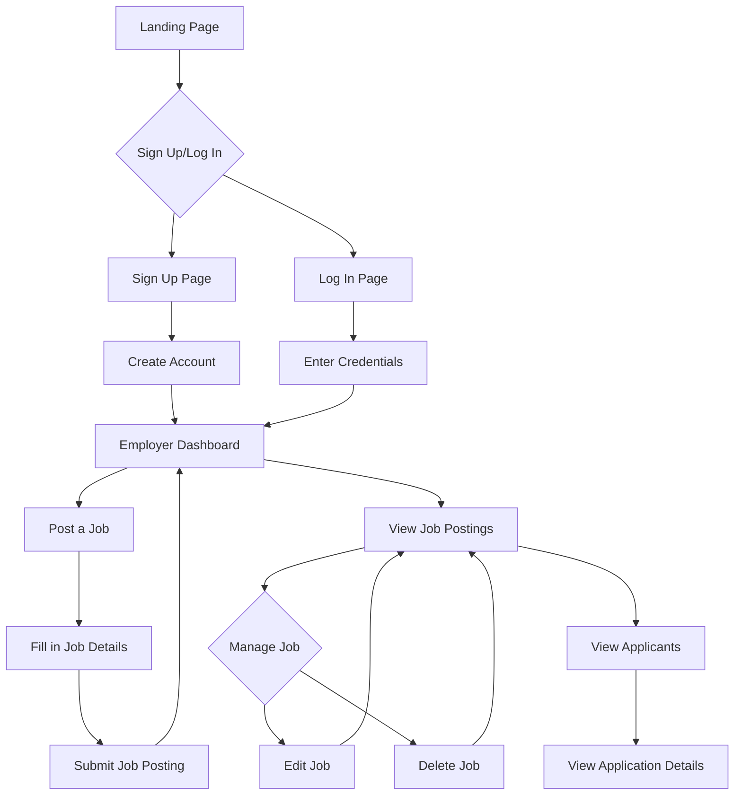

# User Flow for Job Portal MVP

This document outlines the user flow for the main features of the job portal MVP. The flow is divided into two main sections: Job Seeker Flow and Employer Flow.

## 1. Job Seeker Flow

### 1.1. Onboarding

1.  **Landing Page:** The user arrives at the landing page, which displays a prominent search bar for jobs.
2.  **Sign Up:** The user clicks on the "Sign Up" button, fills out the registration form (Name, Email, Password), and creates an account.
3.  **Log In:** The user clicks on the "Log In" button, enters their credentials, and accesses their account.

### 1.2. Job Search and Application

1.  **Search:** The user enters keywords and/or a location into the search bar and clicks "Search".
2.  **View Results:** The user is taken to a search results page displaying a list of jobs that match their query.
3.  **Filter Results:** The user can filter the results by job type (full-time, part-time, etc.).
4.  **View Job Details:** The user clicks on a job title to view the detailed description of the job.
5.  **Apply:** The user clicks the "Apply" button, which opens a simple application form.
6.  **Submit Application:** The user fills out the form (Name, Email), uploads their resume, and clicks "Submit".

## 2. Employer Flow

### 2.1. Onboarding

1.  **Landing Page:** The user arrives at the landing page and navigates to the employer section.
2.  **Sign Up:** The user clicks on the "Sign Up" button, fills out the registration form (Company Name, Email, Password), and creates an account.
3.  **Log In:** The user clicks on the "Log In" button, enters their credentials, and accesses their account.

### 2.2. Job Posting and Management

1.  **Dashboard:** After logging in, the employer is taken to their dashboard, which displays a list of their active job postings.
2.  **Post a Job:** The employer clicks on the "Post a Job" button, which opens a form to create a new job listing.
3.  **Fill in Details:** The employer fills in the job details (title, description, location, job type) and clicks "Post".
4.  **Manage Jobs:** From the dashboard, the employer can view, edit, or delete their job postings.
5.  **View Applicants:** The employer clicks on a job posting to view a list of applicants for that position.
6.  **View Application Details:** The employer clicks on an applicant's name to view their application details, including their resume.